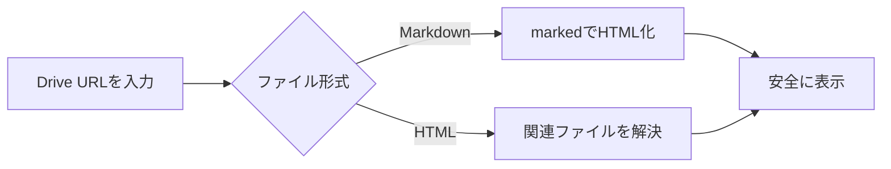
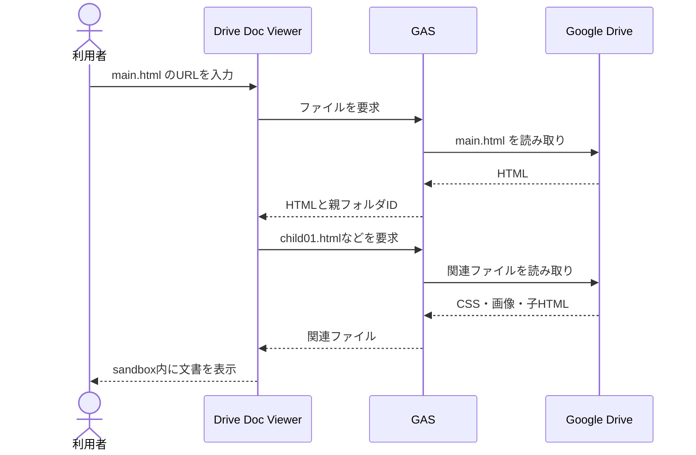

# Mermaid表示テスト

この文書では、フローチャートとシーケンス図を確認できます。

## ドキュメント表示フロー

```mermaid
flowchart LR
    A[Drive URLを入力] --> B{ファイル形式}
    B -->|Markdown| C[markedでHTML化]
    B -->|HTML| D[関連ファイルを解決]
    C --> E[安全に表示]
    D --> E
```

## iframe関連ファイルの取得

```mermaid
sequenceDiagram
    actor User as 利用者
    participant Viewer as Drive Doc Viewer
    participant GAS
    participant Drive as Google Drive

    User->>Viewer: main.html のURLを入力
    Viewer->>GAS: ファイルを要求
    GAS->>Drive: main.html を読み取り
    Drive-->>GAS: HTML
    GAS-->>Viewer: HTMLと親フォルダID
    Viewer->>GAS: child01.htmlなどを要求
    GAS->>Drive: 関連ファイルを読み取り
    Drive-->>GAS: CSS・画像・子HTML
    GAS-->>Viewer: 関連ファイル
    Viewer-->>User: sandbox内に文書を表示
```

## 通常のMarkdownも共存できます

| 確認項目 | 期待値 |
|---|---|
| 見出し | 表示される |
| Mermaid | SVGとして描画される |
| 表 | 通常どおり表示される |
